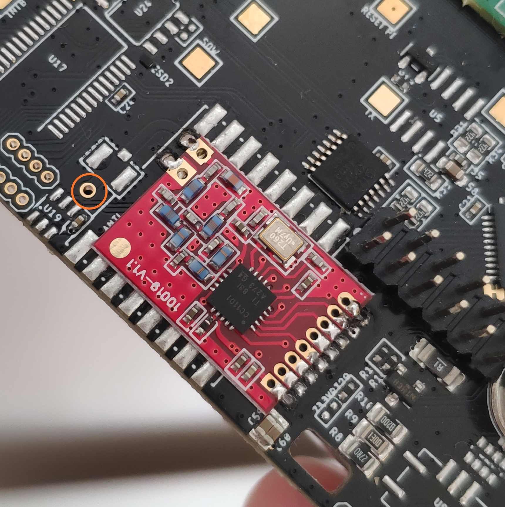

# zero_avr_firmware_culfw
CULFW V1.67 modified for SHPI


## 	Dependencies
You need an CC1101 radio module connected to SHPI. 
Make sure you've added an antenna (a simple wire antenna soldered to the marked orange circle is sufficient)
 and check the solder joints for shorts. 





install with:

```bash
git clone https://github.com/shpi/zero_avr_firmware_culfw.git
cd zero_avr_firmware_culfw/

gpio -g mode 11 out
sleep 1
gpio -g mode 11 in
sleep 1
sudo dfu-programmer atmega32u4 erase
sudo dfu-programmer atmega32u4 flash Devices/CUL/CUL_V3.hex
sudo dfu-programmer atmega32u4 start

minicom -b 9600 -D /dev/ttyACM0

-> "V" enter -> V1.67 CUL868
- > "X67" enter -> no output
-> "C35" enter -> 0D / 13

```


modify board.h to enable/disable radio protocols


compile only for atmega32u4 - potential risk of breaking dfu-firmware


best use with homegear or raw - serialport


## KNOWN BUG

This firmware deactivates PB0. PB0 is used on SHPI for VENT_RPM Signal. Pulling it low on vent turn will make ATmega32u4 go haywire and act as SPI Slave. It should be possible to set ATmega32u4 back as master, but my following code did not work yet. Maybe u have an idea?

My plan is to use CC1100 Slave Select functions and set PB0 only as output, when SPI transfer is going on.

#define CC1100_DEASSERT {\
                 SET_BIT( CC1100_CS_PORT, CC1100_CS_PIN );\
                 CLEAR_BIT(DDRB,PB0);\
                }


#define CC1100_ASSERT {\
                 CLEAR_BIT( CC1100_CS_PORT, CC1100_CS_PIN );\
                 SET_BIT(DDRB,PB0);\
                 SPCR  = _BV(MSTR);\
                }


DATASHEET AVR151 say:

In cases where the AVR is configured for master mode and it can not be ensured that the SS pin
will stay high between two transmissions, the status of the MSTR bit has to be checked before a new byte
is written. After the MSTR bit has been cleared by a low level on the SS line, it must be set by the
application to re-enable SPI master mode.
In slave mode the SS pin is always an input. When SS is held low, the SPI is activated and MISO
becomes output if configured so by the user. All other pins are inputs. When SS is driven high, all pins are
inputs, and the SPI is passive, which means that it will not receive incoming data. The following table
shows an overview of the SS Pin Functionality


